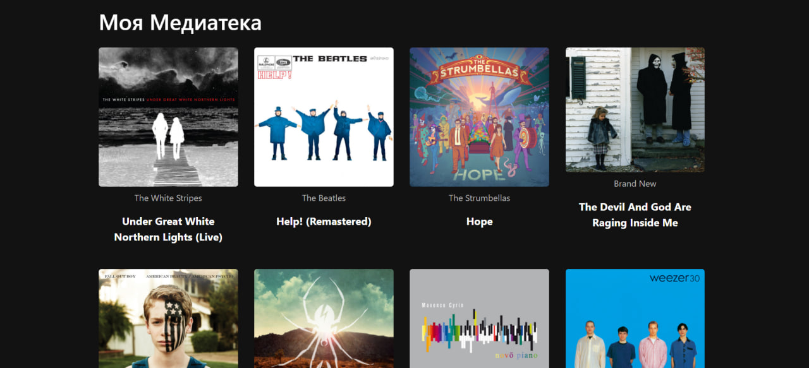

# Spotify Favorite Albums Viewer

## Description

This project is a FastAPI-based web application that connects to the Spotify API, retrieves a user's saved albums, and displays them in a visually appealing interface.




## Features

- **Spotify Album Retrieval**: Connects to the Spotify API to access and retrieve the user’s saved albums, displaying key album details such as the album cover, name, and artist.
- **Responsive Web Interface**: Displays albums in a grid layout, fully responsive and styled with Bootstrap, allowing users to click on each album to open it directly in Spotify.
- **OAuth 2.0 Authentication**: Securely authenticates users with their Spotify account, managing access tokens through Spotify’s OAuth 2.0 flow.

## Setup and Run 

### 1. Clone the Repository

```bash
git clone https://github.com/unrlight/Spotify-Favorite-Albums-Viewer.git
cd Spotify-Favorite-Albums-Viewer
```

### 2. Install Dependencies

```bash
pip install -r requirements.txt
```

### 3. Set Up Spotify API

#### Obtaining the Client ID and Client Secret

1. **Create a Spotify Developer Account**:
   - Visit the [Spotify for Developers Dashboard](https://developer.spotify.com/dashboard/) and log in.
   
2. **Create a New Application**:
   - Click **"Create an App"**, fill out the required information, and accept the terms of service.
   - After creating the app, you’ll see the **Client ID** and **Client Secret** for API access.

3. **Configure Redirect URI**:
   - In your application settings, add a redirect URI, for example: `http://localhost:8005/callback`.
   - This URI is required to properly handle OAuth 2.0 authentication and redirect users back to the app.

### 4. Set Environment Variables

You can configure your credentials either as environment variables or in a `.env` file.

- **Option 1: Set Environment Variables**
    ```bash
    export client_id=YOUR_CLIENT_ID
    export client_secret=YOUR_CLIENT_SECRET
    ```

- **Option 2: Use a `.env` File**

  Create a `.env` file in the root directory with the following content:

    ```dotenv
    client_id=YOUR_CLIENT_ID
    client_secret=YOUR_CLIENT_SECRET
    ```

### 5. Run the Application

```bash
uvicorn main:app --host localhost --port 8005 --reload
```

Access the application in your browser at [http://localhost:8005](http://localhost:8005).
